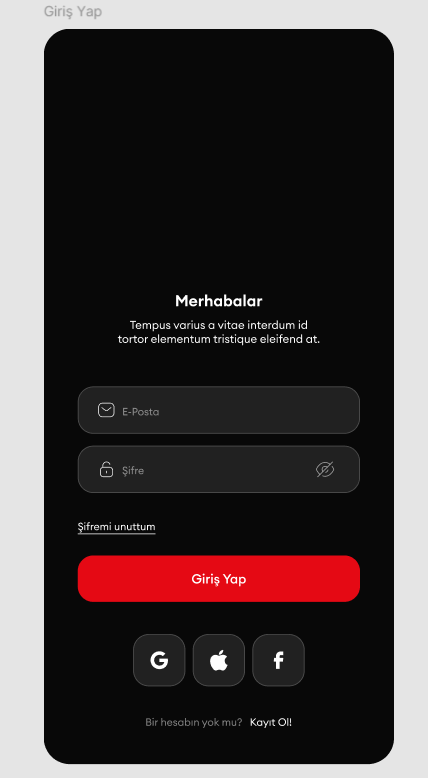
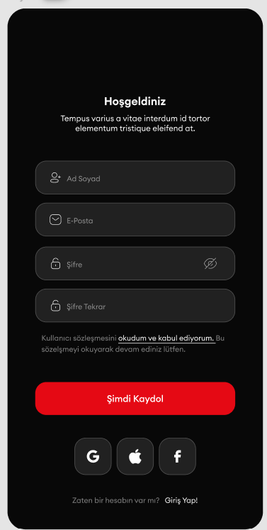
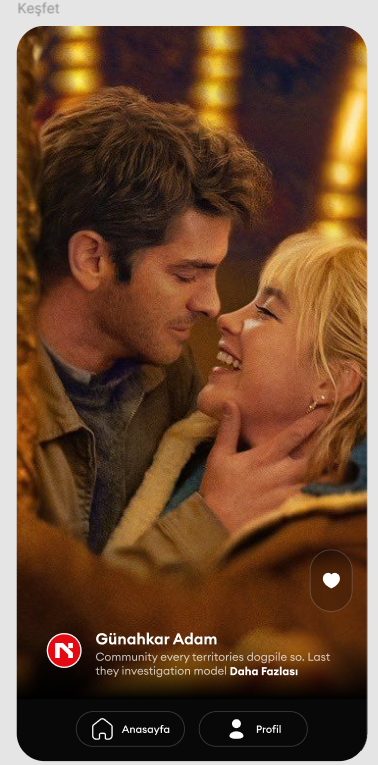
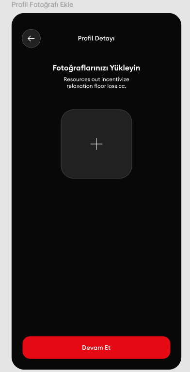
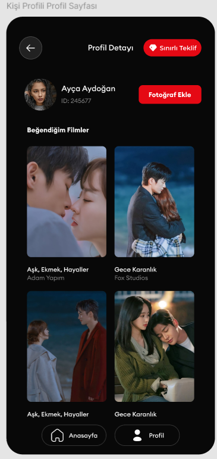
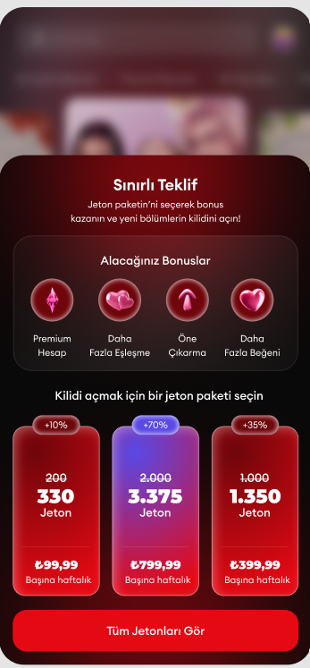

# Dating App - Flutter Developer Case Study

Bu proje, profesyonel bir Flutter geliştirici case study projesidir. Modern yazılım mimarileri ve best practice'ler kullanılarak geliştirilmiştir.

## ⚠️ Önemli Notlar

- **Bu bir case study projesidir** - Gerçek bir production uygulaması değildir.
- **API aktif değildir** - Backend API servisi şu anda aktif olmadığı için uygulama tam olarak çalıştırılamaz.
- **Geliştirmeye müsait değildir** - API bağlantısı olmadığı için yeni özellikler eklenemez veya test edilemez.
- **Lisans yoktur** - Bu proje herhangi bir lisans altında değildir.

## 📱 Ekran Görüntüleri

### Giriş Ekranı


### Kayıt Ekranı


### Keşfet Ekranı


### Profil Ekranı


### Profil Detay Ekranı


### Teklif Ekranı


## 🏗️ Mimari Yapı

Bu proje **Clean Architecture** prensiplerine göre geliştirilmiştir. Her feature modüler bir yapıda organize edilmiştir:

```
lib/
├── core/                    # Çekirdek modüller
│   ├── constants/          # Sabitler ve konfigürasyonlar
│   ├── errors/             # Hata yönetimi
│   ├── network/            # Network katmanı
│   ├── navigation/         # Routing yönetimi
│   ├── theme/              # Tema ve stil
│   └── utils/              # Yardımcı fonksiyonlar
├── features/               # Feature modülleri
│   ├── auth/              # Kimlik doğrulama
│   ├── movies/            # Film özellikleri
│   ├── profile/           # Profil yönetimi
│   └── splash/            # Splash ekranı
└── config/                 # Konfigürasyon
    └── injection/         # Dependency Injection
```

### Katman Yapısı

Her feature modülü 3 ana katmandan oluşur:

1. **Domain Layer** (İş Mantığı)
   - Entities
   - Repositories (Interfaces)
   - Use Cases

2. **Data Layer** (Veri Yönetimi)
   - Data Sources (Remote & Local)
   - Models
   - Repository Implementations

3. **Presentation Layer** (UI)
   - Pages
   - Widgets
   - BLoC / ViewModels

## 🎯 Kullanılan Mimari Desenler

### 1. Clean Architecture
- Katmanlar arası bağımlılık yönetimi
- Dependency Inversion Principle
- Separation of Concerns

### 2. BLoC Pattern (Business Logic Component)
- State management için `flutter_bloc` kullanılmıştır
- Event-driven architecture
- Reactive programming

### 3. MVVM Pattern (Model-View-ViewModel)
- ViewModels ile UI logic ayrımı
- ChangeNotifier kullanımı
- BLoC ile birlikte hibrit yaklaşım

### 4. Repository Pattern
- Data source abstraction
- Network ve local storage yönetimi
- Single source of truth

### 5. Dependency Injection
- `get_it` ile service locator pattern
- Loose coupling
- Testability

## 🛠️ Kullanılan Teknolojiler ve Paketler

### State Management
- **flutter_bloc** (^8.1.6) - BLoC pattern implementasyonu
- **equatable** (^2.0.5) - Value equality
- **rxdart** (^0.27.7) - Reactive extensions

### Network & API
- **dio** (^5.3.2) - HTTP client
- **connectivity_plus** (^5.0.2) - Network connectivity
- **internet_connection_checker** (^1.0.0+1) - Connection checker

### Dependency Injection
- **get_it** (^7.7.0) - Service locator
- **injectable** (^2.4.2) - Code generation for DI

### Local Storage
- **flutter_secure_storage** (^9.0.0) - Secure key-value storage
- **shared_preferences** (^2.2.2) - Simple key-value storage

### Navigation
- **go_router** (^14.2.7) - Declarative routing

### UI Components
- **cached_network_image** (^3.3.0) - Image caching
- **image_picker** (^1.0.4) - Image selection
- **shimmer** (^3.0.0) - Loading animations
- **lottie** (^2.7.0) - Animations

### Firebase
- **firebase_core** (^2.32.0)
- **firebase_crashlytics** (^3.5.7)
- **firebase_analytics** (^10.10.7)

### Localization
- **flutter_localizations** - Multi-language support
- **intl** (^0.20.2) - Internationalization

### Utilities
- **dartz** (^0.10.1) - Functional programming (Either, Option)
- **logger** (^2.0.2+1) - Logging

### Code Generation
- **json_serializable** (^6.7.1) - JSON serialization
- **build_runner** (^2.4.7) - Code generation tool

### Testing
- **bloc_test** (^9.1.7) - BLoC testing
- **mocktail** (^1.0.3) - Mocking framework
- **mockito** (^5.4.2) - Mocking for tests

## 📦 Proje Özellikleri

### Authentication (Kimlik Doğrulama)
- Kullanıcı girişi (Login)
- Kullanıcı kaydı (Register)
- Oturum yönetimi
- Token-based authentication
- Secure storage ile token saklama

### Movies (Filmler)
- Film listesi görüntüleme
- Favori filmler
- Film arama
- Pagination desteği
- Offline caching

### Profile (Profil)
- Kullanıcı profili görüntüleme
- Profil güncelleme
- Fotoğraf yükleme
- Favori filmler listesi

## 🔧 Kurulum

```bash
# Bağımlılıkları yükle
flutter pub get

# Code generation çalıştır (gerekirse)
flutter pub run build_runner build --delete-conflicting-outputs
```

## ⚙️ Konfigürasyon

API endpoint'leri `lib/core/constants/api_constants.dart` dosyasında tanımlanmıştır:

```dart
static const String baseUrl = 'https://caseapi.servicelabs.tech';
```

**Not:** API şu anda aktif olmadığı için uygulama tam olarak çalışmayacaktır.

## 🎨 Tasarım Sistemi

- **Fontlar:** EuclidCircularA, Montserrat
- **Renkler:** Material Design 3 uyumlu
- **Animasyonlar:** Lottie animations
- **Loading States:** Shimmer effects

## 📚 Öğrenilen Best Practices

1. **Clean Architecture** ile modüler ve test edilebilir kod
2. **BLoC Pattern** ile state management
3. **Dependency Injection** ile loose coupling
4. **Repository Pattern** ile data abstraction
5. **Error Handling** ile robust uygulama
6. **Network Layer** abstraction
7. **Local Storage** ile offline support
8. **Code Generation** ile boilerplate azaltma

## 🚫 Sınırlamalar

- API aktif olmadığı için gerçek veri akışı test edilemez
- Backend entegrasyonu yapılamaz
- Yeni özellikler eklenemez (API bağımlılığı nedeniyle)

## 📄 Sonuç

Bu proje, modern Flutter geliştirme pratiklerini ve profesyonel yazılım mimarilerini göstermek amacıyla geliştirilmiş bir case study'dir. Clean Architecture, BLoC pattern, Dependency Injection gibi enterprise-level pattern'lerin Flutter ekosisteminde nasıl uygulanabileceğini göstermektedir.

---

**Not:** Bu proje eğitim ve portföy amaçlıdır. Production kullanımı için uygun değildir.
